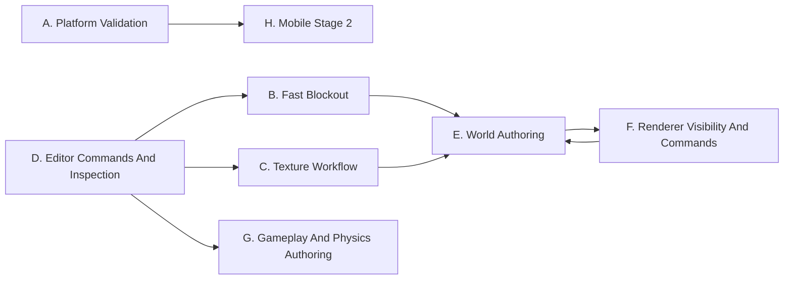

# Friendly Engine Roadmap

This is the planning front door for `friendly-engine`.

Use this document to pick work, split it between contributors, and understand
which files are likely to conflict. Use [PROGRESS.md](../PROGRESS.md) for
current status, [CODEMAP.md](CODEMAP.md) for source locations, and the deeper
reference docs when a stream needs more architecture detail.

## Source Of Truth

| Document | Owns |
|----------|------|
| [ROADMAP.md](ROADMAP.md) | Planned work, dependencies, parallel workstreams, done criteria |
| [PROGRESS.md](../PROGRESS.md) | Completed work, verified milestones, current implementation state |
| [CODEMAP.md](CODEMAP.md) | File map and ownership hints |
| [ARCHITECTURE.md](../ARCHITECTURE.md) | Stable engine architecture and subsystem boundaries |
| [WORLD.md](WORLD.md) | Layered world compiler design and data model |
| [UI.md](UI.md) | Canonical editor UI and UX design goals |
| [EDITOR_UI.md](EDITOR_UI.md) | Detailed editor layout, workflows, and interaction model |
| [PROP_MODE_UX.md](PROP_MODE_UX.md) | Prop workshop UX, library management, display/edit modes, painting |
| [UX_SCENARIOS.md](UX_SCENARIOS.md) | Repeatable editor playtest scenarios and run logs |
| [UI_COPY.md](UI_COPY.md) | UI string rules |
| [EXTENDING.md](EXTENDING.md) | How to add modules, components, requests, and targets |

Completed planning from earlier notes is recorded in [PROGRESS.md](../PROGRESS.md).

## Planning Rules

- Keep each slice shippable.
- Make work visible through framework APIs before adding editor-only behavior.
- Prefer small files with clear ownership.
- Fail fast and loudly when data, assets, platform support, or renderer features
  are missing.
- Update `zig build run-tools -- describe` when a feature becomes public engine
  or editor surface.
- Update [PROGRESS.md](../PROGRESS.md) only after verification commands pass.
- A good parallel task has one owner, one user-visible behavior, one primary
  conflict zone, and one verification command.

## Dependency Map



`E` and `F` intentionally meet at the data boundary: world authoring produces
cell and layer data; renderer preparation consumes visible cells and emits render
commands. Keep that boundary explicit.

## Parallel Work Board

| Stream | Goal | Primary files | Parallel with | Conflict zone | Verify |
|--------|------|---------------|---------------|---------------|--------|
| A. Platform Validation | Prove Stage 1 on Mac, Linux, Windows | `build.zig`, `src/runtime/shared/gpu_backend_sdl*.zig`, runtime mains | B, C, D, E, F, G | backend setup and CLI flags | `zig build test`, platform smoke runs |
| B. Fast Blockout | Make TrenchBroom-like rough geometry fast | `project_editor_blockout.zig`, `project_editor_input.zig`, `project_editor_scene.zig`, `local_csg` | A, D, F, G | `project_editor_ui_build.zig`, scene save format | `zig build check`, editor smoke |
| C. Texture Workflow | Apply and persist readable materials quickly | `project_editor_scene.zig`, `project_editor_ui_build.zig`, `framework/assets.zig`, import tools | A, D, E, G | scene material fields, Assets tab | `zig build check`, scene reload test |
| D. Editor Commands And Inspection | Make editor UI discoverable and editable by the editor | `core_ui`, `pm_ui_build.zig`, `project_editor_ui_build.zig`, `tools/describe.zig` | A, B, C, E, F, G | editor command IDs and screen sections | `zig build run-tools -- describe` |
| E. World Authoring | Edit layers and recompile affected cells | `src/world/compiler`, `world_bake.zig`, `project_editor_world_authoring.zig`, layer modules | A, C, D, F, G | dirty-cell data and diagnostics | `zig build test`, targeted bake |
| F. Renderer Visibility And Commands | Move toward stateless sorted render work | `gpu_api.zig`, `gpu_backend_sdl*.zig`, `render_visibility.zig`, `framework/render.zig` | A, B, D, E, G | GPU backend command submission | `zig build test`, GPU/editor smoke |
| G. Gameplay And Physics Authoring | Author gameplay bodies without leaving the editor | `scene_io.zig`, `physics_types.zig`, `physics.zig`, inspector UI | A, B, C, D, E, F | scene schema and inspector sections | `zig build check`, scene round-trip |
| H. Mobile Stage 2 | Add iOS and Android after desktop validation | build targets, platform windows, input, packaging | D, E, F once A is stable | platform abstractions | platform-specific build/test |
| P. Prop Workshop | Make reusable props in isolated asset space | `project_editor_ui_prop.zig`, `project_editor_prop_asset.zig`, `runtime/shared/prop_asset_doc.zig`, prop tools | A, D, F, G | prop asset docs, Prop UI, renderer preview modes | `zig build test`, prop scenario smoke |

## First Parallel Batch (complete)

Batch 1 shipped 2026-06-15. Verification notes are in
[PROGRESS.md](../PROGRESS.md).

| Slice | Shipped |
|-------|---------|
| D1 | Stable editor command IDs and screen-section ownership in `describe` |
| B1 | Semantic blockout ramp with save/reload and undo/redo |
| C1 | Material asset list in the Assets tab |
| E1 | Dirty cell marking for one authoring-layer edit path |
| F1 | Sorted render command buffers in `render_commands.zig` |
| G1 | Physics body authoring field in scene data and inspector |

## Next Ready Slices

| Slice | Status | Owner lane | Build | Avoid touching | Done when |
|-------|--------|------------|-------|----------------|-----------|
| A1 | Ready | Platform | Run and document Linux Vulkan client/editor smoke checks | editor UI files | pass/fail notes and setup are recorded in `PROGRESS.md` |
| A2 | Ready | Platform | Run and document Windows D3D12 client/editor smoke checks | editor UI files | pass/fail notes and setup are recorded in `PROGRESS.md` |
| B2–G2 | Complete (2026-06-15) | Editor/Renderer/World | Blockout doorway/stair, texture workflow, command palette, world bake, GPU wireframe, gameplay/physics validation | — | see [PROGRESS.md](../PROGRESS.md) verification batch |
| H1 | Scaffolded | Platform | Document mobile gaps; no device targets yet | runtime mains | [MOBILE_STAGE2.md](MOBILE_STAGE2.md) exists |

Pick the next slice from stream "Build next" lists below. If two slices both need
`project_editor_ui_build.zig`, divide by visible section before starting.

## Stream Details

### A. Platform Validation

Why: Stage 1 promises Mac, Linux, and Windows. macOS is the active path, but
Linux Vulkan and Windows D3D12 need real validation.

Build next:

- Run the client and editor on Linux with Vulkan.
- Run the client and editor on Windows with D3D12.
- Document setup, driver requirements, and known failures.
- Use [PLATFORM_VALIDATION.md](PLATFORM_VALIDATION.md) for platform smoke
  checks and record results in [PROGRESS.md](../PROGRESS.md).

Done when:

- `zig build test` passes on each Stage 1 platform.
- `zig build run-client -- --frames 120` opens a GPU window.
- `zig build run-editor -- --frames 30` opens the editor.
- Missing platform support fails explicitly.

Not yet: mobile runtime targets, web runtime, or GPU APIs beyond SDL3 GPU.

### B. Fast Blockout

Why: level blocking should feel quick and direct, in the spirit of TrenchBroom.

Build next:

- Add blockout primitives beyond boxes: doorway, stair (ramp shipped in B1).
- Add face drag resize for selected brush geometry.
- Add exact numeric dimensions after drag.
- Save blockout intent as authoring data, not only baked triangles.
- Connect semantic blockout edits to local CSG layer outputs.

Done when:

- A user can make a floor, walls, and a doorway without leaving Blockout mode.
- Undo/redo covers every blockout edit.
- Saved scenes reload with the same editable blockout intent.
- The viewport gives snap and size feedback while editing.

Not yet: arbitrary brush boolean CSG, destructive runtime CSG, or complex
constructive geometry before semantic pieces work well.

### C. Texture Workflow

Why: fast texturing makes rough spaces readable. The current texture mode is an
MVP paint path, not a production workflow.

Build next:

- Apply materials to selected faces.
- Add Fit, Align, Rotate, and Scale controls.
- Store texture scale in world units.
- Show missing material errors in the inspector or bottom strip.

Done when:

- Users can apply a material to a face or object.
- Texture transforms persist in scene data.
- Missing assets fail with clear editor errors.
- The asset bundle path resolves the same material at runtime.

Not yet: node material graphs, physically based material editing, or texture
painting layers.

### D. Editor Commands And Inspection

Why: the editor is built with the same `core_ui` framework as projects. The next
step is making editor structure inspectable and eventually editable by the
editor.

Build next:

- Add a command palette backed by the command catalog.
- Add an in-editor UI tree inspector.
- Add a small workflow for editing editor UI copy and labels.

Done when:

- `zig build run-tools -- describe` lists editor screens and commands.
- A developer can find a visible control's owning source quickly.
- New editor controls are added in `core_ui` first.
- SDL rect hit-testing does not return to editor chrome.

Not yet: visual programming for editor internals, in-editor Zig editing, or a
plugin marketplace UI.

### E. World Authoring

Why: layered world compilation exists, but authoring workflows are still thin.
The editor should let developers edit world layers and recompile affected cells.

Build next:

- Add targeted recompile from the editor.
- Hot-reload a baked `.fcell` after recompile.
- Add visual feedback for cell bounds and dirty state.
- Add authoring controls for one layer at a time.

Done when:

- Editing a layer recompiles only affected cells.
- The editor can reload updated cell data without restarting.
- Compile errors identify the layer, cell, file, and field.
- `world.cells.describe` reports useful editor diagnostics.

Not yet: background distributed baking, large-world streaming UI polish, or
runtime live editing as gameplay.

### F. Renderer Visibility And Commands

Why: the GPU path is production-shaped but modest. The next renderer work should
improve scene scale and clarity without overbuilding.

Renderer constraints:

- Keep the GPU backend thin and explicit.
- Move toward stateless render commands before adding a render graph.
- Give every draw or GPU command an explicit sort key.
- Keep backend state caches as implementation details.
- Keep visibility and batching outside SDL GPU backend logic.
- Parse only implemented render settings; reject future modes until their data
  exists.

Build next:

- Add wireframe overlay support to the GPU path.
- Improve material identity and batching.
- Add CPU-side cell-aware visibility preparation.
- Report visibility stats for editor inspection and runtime diagnostics.

Done when:

- Render commands can be generated independently and sorted deterministically.
- The SDL backend can consume sorted commands without changing public editor or
  client behavior in one large step.
- Visibility preparation emits compact render work from visible cells.
- Invalid render usage errors loudly.

Not yet: async compute, multi-GPU scheduling, data-driven graph authoring,
GPU-driven culling, temporal AA, or checkerboard/upscale resolve.

### G. Gameplay And Physics Authoring

Why: scenes already spawn gameplay and physics data, but authoring should be
comfortable and visible in the editor.

Build next:

- Add validation for unsupported body or collider shapes.
- Add simple gameplay component fields to scene save/load.
- Extend `describe` when fields become public.

Done when:

- A user can add or edit a basic physics body in the editor.
- Scene save/load preserves the authored data.
- Runtime spawn consumes the same data without editor-only translation.
- Unsupported combinations fail with specific errors.

Not yet: a visual scripting system, full gameplay component editor, or runtime
live-edit replication.

### H. Mobile Stage 2

Why: iOS and Android are Stage 2 after desktop validation.

Build next after A is healthy:

- Identify platform window, input, file, and packaging gaps.
- Keep renderer assumptions explicit and portable.
- Add target-specific smoke builds.
- Document device setup.

Done when:

- A simple client build launches on device or emulator.
- Input and window lifecycle are handled explicitly.
- Unsupported desktop-only features fail clearly.

Not yet: mobile-first UI, app store packaging polish, or web runtime.

## Handoff Template

Use this when splitting work:

```text
Stream:
Slice:
Goal:
Primary files:
Files to avoid:
Expected public behavior:
Verification:
Docs to update:
Known conflicts:
```

## Definition Of Ready

- The slice names its stream and expected visible behavior.
- The primary files and files to avoid are known.
- The verification command is known before coding starts.
- Any scene, asset, schema, or describe surface change is called out.

## Definition Of Done

- The slice works in the editor, runtime, or tool path it targets.
- `zig build check` passes unless a broader command is required.
- Tests are added or updated where the changed behavior is reusable logic.
- Docs or generated descriptions are updated when public behavior changes.
- The implementation follows the no-fallback rule.
