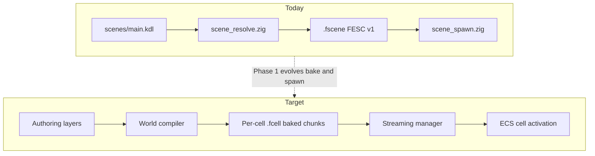

# Layered World Model

Canonical world architecture for friendly-engine. See [ARCHITECTURE.md](../ARCHITECTURE.md) for engine-wide layers, gems, and asset pipeline.
World implementation sequencing lives in [ROADMAP.md](ROADMAP.md), Stream E.

## Purpose

friendly-engine supports fast, simple world authoring while remaining performant enough for open-world games. The core idea is to preserve CSG-style construction—simple shapes, direct editing, rapid iteration—without making raw CSG the runtime representation or forcing every game world through one geometry system.

World creation is a set of **authoring layers** that compile into optimized, streamable **runtime chunks**.

## Core Principle

CSG-like tools are valuable for authoring, but they should not define the whole engine.

The engine should not ask:

> How do we make all worlds out of CSG?

It should ask:

> How do we let designers express world structure simply, then compile that intent into efficient runtime data?

The runtime uses conventional optimized assets: meshes, collision, navmesh, visibility data, lighting data, foliage instances, terrain LODs, and streaming chunks.

The unifying model is not CSG. The unifying model is the compiled **WorldCell**.

## Current State vs Target

The engine now has an MVP world path alongside scene authoring. Projects declare scene-to-world mappings in `engine.kdl` with `scene path="..." world="..."`, bake cells to `.fcell`, stream a 3x3 outdoor region around the camera, and activate interior child cells linked from loaded parent cells. The authoring experience is still early: layer modules can emit MVP compiler outputs, but the editor workflows described below are not complete yet.

| Area | Today | Target |
|------|-------|--------|
| Spatial model | `WorldCell` grid implemented with `(x, y, z)` ids, bounds, neighbor lists, and interior parent links | Rich cell metadata, editor visualization, and dependency-aware hot reload |
| Authoring | Scene files plus MVP layer data under `layers/`; editor still focuses on scene primitives and blockout tools | Seven specialized editor-facing layers (see below) |
| Compilation | [`world_bake.zig`](../src/tools/world_bake.zig) bakes all manifest cells or one targeted `--cell x,y,z` to `.fcell`; [`scene_bake.zig`](../src/tools/scene_bake.zig) still emits monolithic `.fscene` | Dirty tracking and merged production layer outputs |
| Runtime load | [`stream.zig`](../src/world/stream.zig) loads/unloads a budgeted 3x3 outdoor region and parent-linked interiors via synchronous `.fcell` IO; [`cell_spawn.zig`](../src/game/cell_spawn.zig) activates cell contents; runtime requests expose active cell describe/reload hooks | Tuned streaming regions, LOD transitions, async IO, and file-watcher driven hot-swap |
| Collision / nav | Per-cell collision shape data and MVP nav buffers are encoded | Production collision cook, navmesh tile generation, and editor validation |
| CSG | Blockout subtract deletes overlapping whole objects; local CSG gem has MVP semantic outputs | Local, compiler-driven semantic cuts that split geometry and update portals/nav/collision |



### Key existing files

| Role | Path |
|------|------|
| KDL parse/format | [`src/runtime/shared/scene_kdl.zig`](../src/runtime/shared/scene_kdl.zig) |
| Scene document | [`src/runtime/shared/scene_document.zig`](../src/runtime/shared/scene_document.zig) |
| Load/save | [`src/runtime/shared/scene_io.zig`](../src/runtime/shared/scene_io.zig) |
| Baked scene binary (`FESC` v1) | [`src/runtime/shared/scene_binary.zig`](../src/runtime/shared/scene_binary.zig) |
| Scene bake tool | [`src/tools/scene_bake.zig`](../src/tools/scene_bake.zig) |
| ECS spawn | [`src/game/scene_spawn.zig`](../src/game/scene_spawn.zig) |
| Editor blockout | [`src/runtime/editor/project_editor_scene.zig`](../src/runtime/editor/project_editor_scene.zig) |
| Gem extension | [`src/modules/mod.zig`](../src/modules/mod.zig), [`docs/EXTENDING.md`](EXTENDING.md) |

## High-Level Architecture

```text
Authoring Systems
  ├─ Terrain
  ├─ Splines
  ├─ Scatter / foliage
  ├─ Modular points of interest
  ├─ Parametric buildings
  ├─ Sector interiors
  └─ CSG-like local construction

        ↓

World Compiler

        ↓

Runtime Chunks
  ├─ Render meshes
  ├─ Collision
  ├─ Navmesh tiles
  ├─ Visibility data
  ├─ Terrain LODs
  ├─ Foliage clusters
  ├─ Lighting / probes
  ├─ Audio geometry
  └─ Streaming dependencies
```

## Runtime World Model

The world is divided into streamable cells. Each cell contains the data needed to render, simulate, and navigate that region.

### CellId and bounds

- `CellId` is integer grid coordinates `(x, y)` for outdoor worlds. Use `(x, y, z)` when vertical stacking is required (multi-floor interiors, stacked districts).
- Default cell size: **256 m** per axis (configurable in `world.kdl`).
- World-space bounds for cell `(cx, cy)`:
  - `min = (cx * cell_size_m, 0, cy * cell_size_m)`
  - `max = min + (cell_size_m, cell_height_m, cell_size_m)`

### `world.kdl` manifest

The manifest is the authoring entry point for world streaming. Its schema is checked in at [`docs/schema/world.schema.json`](schema/world.schema.json) and generated by [`src/tools/schemas.zig`](../src/tools/schemas.zig).

```kdl
world version=1 id="main" cell_size_m=256 {
  cell coord="0,0,0" authoring="scenes/main.kdl"
  cell coord="0,0,1" authoring="scenes/interior.kdl" interior_parent="0,0,0"
}
```

Validation enforced by [`manifest.zig`](../src/world/manifest.zig):

- `schema_version` must be `1`.
- `world_id` is optional; when omitted, it is derived from the manifest filename and must not be empty.
- `cell_size_m` must be finite and greater than `0`.
- `cells` must contain at least one entry.
- `coord` and `interior_parent` use either `[x, y]` or `[x, y, z]`; omitted `z` resolves to `0`.
- Cell coordinates must be unique.
- `interior_parent`, when present, must reference another manifest cell and cannot reference the same cell.

The JSON Schema covers the structural contract and rejects unknown top-level or cell fields. Cross-cell checks such as duplicate coordinates and dangling interior links are validated by the loader.

### WorldCell contents

```text
WorldCell
  ├─ Terrain patch
  ├─ Terrain LODs
  ├─ Static mesh batches
  ├─ Instanced props
  ├─ Foliage clusters
  ├─ Collision data
  ├─ Navmesh tile
  ├─ Lighting probes
  ├─ Audio regions
  ├─ Occlusion data
  └─ Links to neighboring cells / interiors
```

At runtime the engine streams nearby cells at high detail, distant cells at reduced detail, and unloads cells outside the active region.

## Authoring Layers

Each layer exposes authoring data and compiles into cell-local outputs. Layers are independent authoring languages; all compile into the same `WorldCell` format.

### 1. Terrain Layer

**Purpose:** Large outdoor landscapes.

**Representation:**

```text
heightfield tiles
+ material splat maps
+ biome masks
+ terrain LODs
+ collision heightfields
```

**Use for:** hills, valleys, fields, forests, roads, outdoor traversal, large-scale landforms.

**Repo status:** MVP compiler module exists in [`src/modules/terrain/`](../src/modules/terrain/) with editor live preview, splat texture baking, distance LOD, clipmap cell loading, heightfield collision shapes, and debounced cell bake. Production clipmap GPU pipeline and runtime virtual texturing are not implemented yet.

**Compile outputs:** terrain mesh LODs, splat materials, heightfield collision, biome masks for scatter.

### 2. Spline Layer

**Purpose:** Long continuous world features.

**Use for:** roads, rivers, paths, fences, walls, cliffs, rails, pipes, shorelines, trails, power lines.

A spline can modify multiple outputs at once:

```text
road graph edge
  → deforms terrain
  → generates road mesh
  → paints material mask
  → places edge props
  → updates nav preference
  → creates collision
```

**Repo status:** MVP compiler module exists in [`src/modules/splines/`](../src/modules/splines/) with v2 road graph nodes/edges, road mesh/collision emission, terrain deformation and material-mask blobs, and editor road placement (click-to-add draft nodes, drag segment, Enter/double-click finish, `layers/splines.kdl` graph persistence, live viewport mesh preview, terrain height/splat deformation on commit, debounced cell bake). Production edge props, nav preference overlays, and direct handle hit-testing are still missing.

**Compile outputs:** deformed terrain samples, spline meshes, material masks, scatter exclusion zones, nav cost overlays.

### 3. Scatter Layer

**Purpose:** Repeated natural or decorative objects via procedural rules.

**Examples:** trees in forest biomes, grass on shallow slopes, rocks near cliffs, reeds near water, lanterns along paths.

**Inputs:** biome masks, slope, altitude, distance from roads/water, noise fields, exclusion zones, hand-painted density masks.

**Repo status:** MVP compiler module exists in [`src/modules/scatter/`](../src/modules/scatter/) and can emit instance clusters. Density masks, exclusion painting, biome integration, and production cluster rendering controls are still missing.

**Compile outputs:** foliage instance clusters (position, rotation, scale, mesh/material refs).

### Atmosphere Layer

**Purpose:** Project-wide sky tone, directional sun/moon lighting, and distance fog.

**Representation:**

```text
sky_tone (sun/moon azimuth + elevation)
+ fog_bank (project default color, start/end distance)
+ cell_fog_bank cell="x,y,z" ... (optional per-cell fog overrides)
```

**Repo status:** MVP compiler module exists in [`src/modules/atmosphere/`](../src/modules/atmosphere/) with editor Atmosphere tool (inspector sun/moon/fog controls with cell scope indicator for fog, live sky tint and fog preview in software + GPU viewport paths), persistence to [`layers/atmosphere.kdl`](../layers/atmosphere.kdl), debounced per-cell dirty bake for fog edits and world-wide bake for sky tone, and runtime client **volumetric fog** from per-cell `atmosphere.settings` blobs keyed to the active camera cell (4-slice exponential integration along the view ray with height-based density falloff; shared math in [`fog_math.zig`](../src/modules/atmosphere/fog_math.zig), [`render_fog.zig`](../src/runtime/shared/render_fog.zig), and [`TexturedQuadLit.frag.wgsl`](../src/runtime/shared/shaders/source/TexturedQuadLit.frag.wgsl); software rasterizer + SDL3 GPU lit shader; fails fast when blob missing on world-streamed cells).

**Compile outputs:** per-cell `atmosphere.settings` blob (cell-specific fog when authored), directional light-probe intensity metadata.

### 4. Modular POI Layer

**Purpose:** Points of interest built from clean modular pieces or prefabs.

**Examples:** cabins, shrines, ruins, towers, bridges, settlements, dungeon entrances.

**Repo status:** Framework MVP exists in [`src/framework/prefab.zig`](../src/framework/prefab.zig). Editor-facing prefab authoring and full world compiler integration are not implemented yet.

**Compile outputs:** static mesh batches, instanced props, collision hulls, portal links to interiors.

### 5. Parametric Building Layer

**Purpose:** Semantic buildings rather than arbitrary boolean geometry.

```text
Building
  ├─ floors
  ├─ rooms
  ├─ walls
  ├─ doors
  ├─ windows
  ├─ stairs
  ├─ roof
  └─ exterior shell
```

**Repo status:** MVP compiler module exists in [`src/modules/buildings/`](../src/modules/buildings/) and can generate basic building mesh outputs. Semantic building authoring, portal records, trim generation, collision cook, and LOD shells are still missing.

**Compile outputs:** exterior/interior meshes, wall sections, trim, collision, portals, nav links, LOD shells.

### 6. Sector Interior Layer

**Purpose:** Interiors, dungeons, tunnels, and constructed spaces via room-graph model.

```text
Sector
  ├─ 2D floor plan
  ├─ floor height
  ├─ ceiling height
  ├─ wall materials
  ├─ portals
  ├─ stairs
  └─ room metadata
```

**Repo status:** MVP compiler module exists in [`src/modules/sectors/`](../src/modules/sectors/) and can emit sector mesh/blob outputs. Room authoring, portals, visibility baking, collision cook, and navmesh tiles are still missing.

**Compile outputs:** sector meshes, portal graph, indoor occlusion data, navmesh tiles, lighting volumes.

### 7. CSG-like Local Construction

**Purpose:** Local authoring for blockouts and hard-surface spaces. Not the global world representation.

**Use for:** blockouts, architectural cutouts, alcoves, stairs, sealed doors, simple hard-surface spaces, special setpieces.

Avoid arbitrary world-scale boolean operations. Interpret many CSG operations semantically:

```text
Designer places doorway subtract brush
  → engine splits wall segment
  → inserts doorway opening
  → places trim/frame mesh
  → creates portal
  → updates collision
  → updates navmesh
```

**Repo status:** Local CSG is implemented as compiler-side generated solids for boxes, wedges, and vertical convex prisms. Editor blockout operations persist semantic add/subtract operations into [`src/modules/local_csg/`](../src/modules/local_csg/), which emits union-aware render meshes, split collision, trim, and doorway portal metadata. Broader CSG authoring controls and production nav updates are still incomplete per [PROGRESS.md](../PROGRESS.md).

**Compile outputs:** wall segments, openings, trim meshes, collision, portal records.

## Compilation Pipeline

Every authoring layer compiles into cell-local outputs.

```text
Authoring data
  ↓
Find affected cells
  ↓
Compile layer output per cell
  ↓
Merge outputs
  ↓
Generate runtime data
  ↓
Package streamable chunks
```

### Layer interface

Planned Zig interface aligned with gem conventions:

```zig
pub const CellId = struct {
    x: i32,
    y: i32,
    z: i32 = 0,
};

pub const CellLayerOutput = struct {
  // Partial contribution from one layer for one cell.
};

pub const WorldCompilerLayer = struct {
    name: []const u8,
    affected_cells: *const fn (ctx: *CompileContext) []CellId,
    compile_cell: *const fn (ctx: *CompileContext, cell: CellId) !CellLayerOutput,
};
```

**Merge semantics:** each registered layer produces a `CellLayerOutput` per affected cell. The compiler merges all layer outputs into `WorldCellData`, runs cleanup passes, then bakes to `.fcell`.

### Incremental recompile

```text
edit authoring layer
  ↓
mark affected cells dirty
  ↓
recompile dirty cells in background
  ↓
hot-swap compiled outputs at runtime
```

Today's editor loads and saves the whole [`scenes/main.kdl`](../scenes/main.kdl) file. Future editor sessions will mark dirty cells and trigger partial recompile.

## Baked Runtime Outputs

Each cell bake should produce:

- terrain meshes and terrain LODs
- static render meshes and static mesh batches
- foliage instance clusters
- collision data and simplified collision hulls
- navmesh tiles
- lighting probes and lightmaps where appropriate
- audio occlusion geometry
- indoor portal data and outdoor occlusion data
- streaming dependencies (neighbor cells, interior links, shared mesh pool refs)
- impostors and distant LODs

### Binary format: `FCEL`

Per-cell baked output uses magic **`FCEL`** (Friendly Engine Cell), parallel to scene magic **`FESC`** in [`scene_binary.zig`](../src/runtime/shared/scene_binary.zig).

Planned cache path:

```text
assets/cache/<target>/world/<world_id>/cells/<x>_<y>_<z>.fcell
```

`FCEL` is additive. Monolithic `.fscene` remains valid for small single-cell games.

The runtime should not evaluate CSG or rebuild whole worlds unless the game explicitly requires live editing or destruction.

## Visibility Model

### Outdoor visibility

- streaming and cell activation ranges
- distance culling
- LODs and impostors
- terrain occlusion
- hierarchical occlusion
- foliage clustering

### Indoor visibility

- rooms and sectors
- portals and occluders
- sector visibility graph
- local cell streaming for large interiors

Outdoor and indoor systems coexist. An open-world cell can contain an entrance to an interior that streams separately.

## Geometry Cleanliness Strategy

Limit arbitrary geometry operations to local, structured contexts.

**Preferred methods:**

- semantic rooms instead of raw boolean solids
- wall segments instead of intersecting boxes
- grid snapping for architectural systems
- modular trim and frame meshes
- parametric doors, windows, and stairs
- sector-based interiors
- heightfield terrain for landscapes
- baked cleanup passes for generated meshes

**Compiler cleanup passes:**

```text
snap vertices
merge coplanar faces
remove tiny faces
weld vertices
fix T-junctions
triangulate cleanly
generate UVs
validate collision
```

## Designer Workflow

Designers work with high-level tools:

```text
paint terrain
draw road
place forest region
draw building footprint
cut doorway
raise ceiling
place dungeon entrance
scatter props
mark interior rooms
```

The engine compiles those actions into optimized runtime content. The designer experience stays simple and spatial without storing everything as editable solids at runtime.

## Migration from Monolithic Scenes

Current projects remain valid without code changes.

1. **Single-cell world:** a `world.kdl` manifest with one cell at `(0, 0)` pointing at the existing scene path.
2. **`.fscene` support:** monolithic baked scenes continue to work for small games. `FCEL` is additive.
3. **Editor modes:** object, blockout, edit, and texture paint modes continue until layer-specific tools land in later phases.
4. **`engine.kdl`:** every playable scene must have an explicit `scene path="..." world="..."` entry. `startup_scene` selects which configured scene boots first.

Example manifest:

```json
{
  "schema_version": 1,
  "world_id": "main",
  "cell_size_m": 256,
  "cells": [
    { "coord": [0, 0, 0], "authoring": "scenes/main.kdl" }
  ]
}
```

## Module Placement Guide

| Concern | Planned home |
|---------|----------------|
| Cell types and manifest | [`src/world/cell.zig`](../src/world/cell.zig), [`src/world/manifest.zig`](../src/world/manifest.zig) |
| Compiler orchestration | [`src/world/compiler/`](../src/world/compiler/), [`src/tools/world_bake.zig`](../src/tools/world_bake.zig) |
| Streaming manager | [`src/world/stream.zig`](../src/world/stream.zig) or [`src/framework/world_stream.zig`](../src/framework/world_stream.zig) |
| Authoring layer gems | [`src/modules/terrain/`](../src/modules/terrain/), `splines/`, `scatter/`, etc. per [docs/EXTENDING.md](EXTENDING.md) |
| Runtime cell activation | [`src/game/cell_spawn.zig`](../src/game/cell_spawn.zig) evolving from [`scene_spawn.zig`](../src/game/scene_spawn.zig) |
| Editor layer tools | [`src/runtime/editor/project_editor_<layer>.zig`](../src/runtime/editor/) per existing mode split |
| Per-cell binary codec | [`src/world/fcell.zig`](../src/world/fcell.zig) |

Authoring layers register as gems with `WorldCompilerLayer` hooks in `register`. The world bake CLI merges layer outputs and writes `.fcell` files to `assets/cache/`.

## Implementation Phases

| Phase | MVP status | Still missing |
|-------|------------|---------------|
| 1. Runtime chunk system | Implemented: manifest load, `.fcell` codec, full/targeted world bake CLI, budgeted stream manager, cell spawn, active cell describe/reload requests | Async IO, file-watcher hot-swap, editor cell visualization, richer dependency handling |
| 2. Terrain and splines | Terrain editor MVP and spline editor MVP: compiler modules emit meshes, collision, nav buffers; editor supports terrain paint and v2 road graph placement with live preview and terrain deformation | Production material splats, direct graph handle editing, production collision strips, scatter authoring |
| 3. Sector interiors | MVP sector mesh/blob outputs exist | Room editor, portal graph tooling, visibility bake, navmesh tiles |
| 4. Parametric buildings | MVP generated meshes exist | Semantic building authoring, door/window portals, trim, LOD shells |
| 5. Scatter system | MVP instance cluster outputs exist | Density/exclusion authoring, biome integration, runtime cluster controls |
| 6. Local CSG-like tools | Semantic outputs, editor blockout persistence, and generated-solid box/wedge/prism union-subtract exist | Broader CSG authoring controls, wall splitting polish, nav updates |

### Phase 1: Runtime Chunk System

**Objective:** Streamable cell format and load/unload foundation.

**Implemented files:** [`src/world/cell.zig`](../src/world/cell.zig), [`manifest.zig`](../src/world/manifest.zig), [`stream.zig`](../src/world/stream.zig), [`fcell.zig`](../src/world/fcell.zig), [`src/tools/world_bake.zig`](../src/tools/world_bake.zig), [`src/game/cell_spawn.zig`](../src/game/cell_spawn.zig).

**Dependencies:** Existing scene bake pipeline ([`scene_bake.zig`](../src/tools/scene_bake.zig), [`scene_binary.zig`](../src/runtime/shared/scene_binary.zig)).

**Acceptance criteria:**

- [x] `world.kdl` manifest loads and resolves cell authoring paths.
- [x] `zig build run-tools -- world-bake` produces `.fcell` per cell from manifest cells.
- [x] Client loads a 3x3 cell region around the camera and unloads the outer ring when the camera moves.
- [x] Parent-linked interior cells load with active parent cells.
- [x] Each active cell contributes render meshes, collision shapes, instance lists, light/probe metadata, and neighbor/dependency data.
- [x] `zig build run-client` resolves the startup scene's configured world manifest.

### Phase 2: Terrain and Splines

**Objective:** Large outdoor support.

**Planned files:** `src/modules/terrain/`, `src/modules/splines/`, terrain authoring format, spline deformation hooks in compiler.

**Dependencies:** Phase 1.

**Acceptance criteria:**

- Heightfield terrain tiles bake into cell terrain patches with at least two LOD levels.
- Material splat maps compile per cell.
- Road spline deforms terrain height and paints a material mask in affected cells.
- Spline generates a road mesh and collision strip per crossed cell.

### Phase 3: Sector Interiors

**Objective:** Clean indoor spaces.

**Planned files:** `src/modules/sectors/`, sector authoring format, portal visibility bake.

**Dependencies:** Phase 1.

**Acceptance criteria:**

- Sector floor plan compiles to wall/floor/ceiling meshes with collision.
- Portal graph bakes into cell occlusion data.
- Interior cell streams independently from outdoor parent cell.
- Navmesh tile generates for sector floors.

### Phase 4: Parametric Buildings

**Objective:** Semantic building generation.

**Planned files:** `src/modules/buildings/`, building descriptor format, generator in compiler.

**Dependencies:** Phase 3 (portal and wall segment model).

**Acceptance criteria:**

- Building footprint with floors, rooms, doors, and windows compiles to exterior and interior meshes.
- Door openings create portal records and trim meshes.
- Building LOD shell bakes for distant cells.

### Phase 5: Scatter System

**Objective:** Procedural instance placement.

**Planned files:** `src/modules/scatter/`, density mask authoring, instance cluster bake.

**Dependencies:** Phase 2 (biome and terrain masks).

**Acceptance criteria:**

- Scatter rules using slope, biome, and exclusion zones compile to instance clusters per cell.
- Runtime draws clusters without per-instance scene entities.
- Hand-painted density masks override procedural defaults.

### Phase 6: Local CSG-like Tools

**Objective:** Structured volume editing for constructed spaces.

**Planned files:** `src/modules/local_csg/`, semantic cut interpreter in compiler, editor blockout evolution.

**Dependencies:** Phase 3 or 4 (wall segment model).

**Acceptance criteria:**

- Doorway subtract brush splits a wall segment and inserts opening plus trim (not whole-object delete).
- Additive blocks snap to grid and compile to wall segments.
- Blockout editor mode delegates to semantic compiler instead of deleting overlapping objects.

## Summary

friendly-engine is a **layered world compiler** with CSG-like authoring where appropriate.

```text
CSG-like tools are one authoring language.
Terrain, splines, sectors, modules, and scatter are others.
All compile into the same runtime chunk format.
```

Runtime is simple and fast:

```text
stream chunks
render meshes
draw instances
query collision
use navmesh
apply visibility
load/unload cells
```

The editor remains expressive:

```text
draw, carve, paint, scatter, place, generate
```
